#Calender Application For communication Tracking
## Features

- **Monthly Calendar View:** Displays all months with clickable dates.  
- **To-Do Tasks:** Add tasks for each specific date to track communication plans.  
- **Communication Tracking:** Communicate with different comapnies.  
- **User-Friendly Navigation:** Simple navigation bar to switch between different application sections.  

---
## Tech Stack

- **Frontend:** React.js  
- **Backend:** Node.js, Express.js  
- **Database:** MongoDB  
- **Styling:** Tailwind CSS 

---
## Setup and Installation
# For Client
cd client
npm install

# For Server
cd ../server
npm install

# FRONT END(Client)
Step 1.Create a React APP Client
 
Here We create  WEB Pages  Uisng REACT.JS
1.NAVBAR
2.HOME
2.ADMIN
3.DASHBOARD
4.ANALYTICS
5.CALENDER
6.USER
# NavBar and HOME page

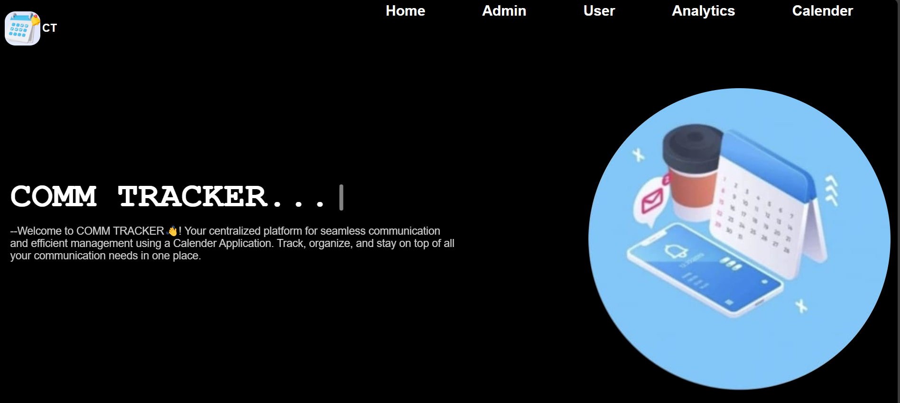

# ADMIN PAGE

In Admin page The Company people add their details about their Company and if they Click Add Company Button then it will show the details of the company and we can Edit and Delete the Companies,And we can Save the Details
Here are the Related Pictures..

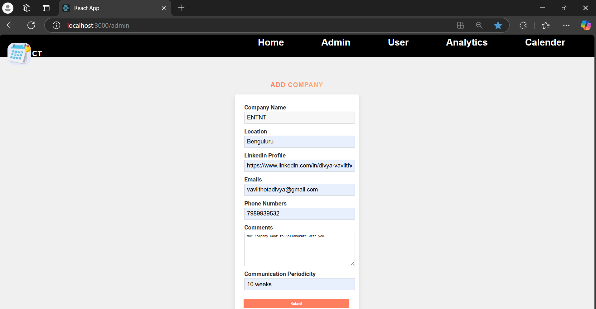

After Clicking The Add Company Button it will give the Notification that the "Company Added Successfully.

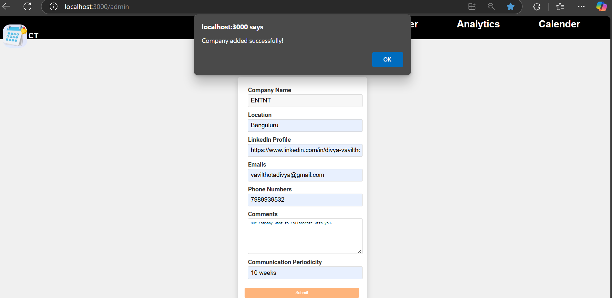

The If we want to EDIT or Delete we can Perform

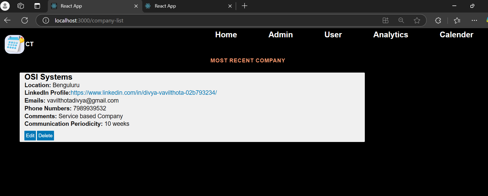

If we Click on EDIT Button.We can perform the oedit operation

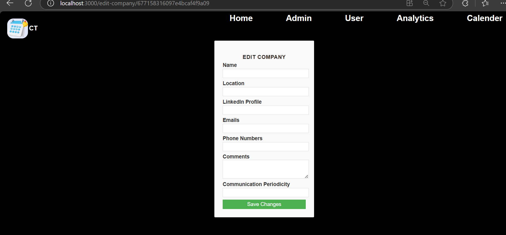

If we Click on Delete Button,The company details will be deleted.

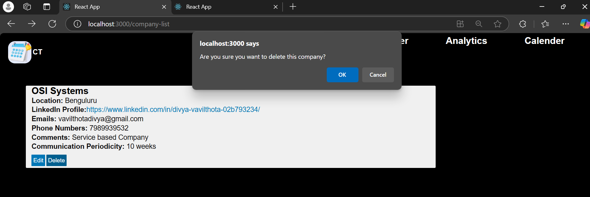

If we Click on Ok(For Conformation)

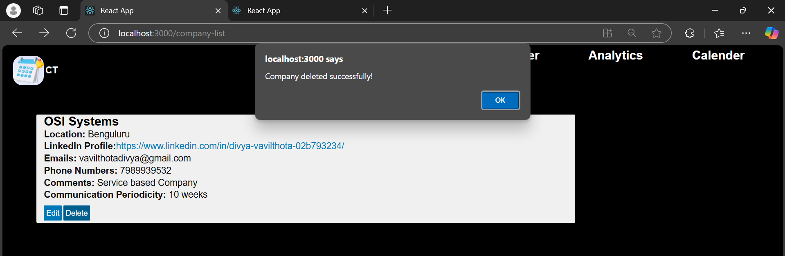

# USER Page
In User Page We will see all the details of the company like the Company Name,Last Five Communications,Next Scheduled Communications,Status,Actions,And we will write the notes too
-- We can see the Overdue(Red) and Due Today(Yellow) with their respective Colours.

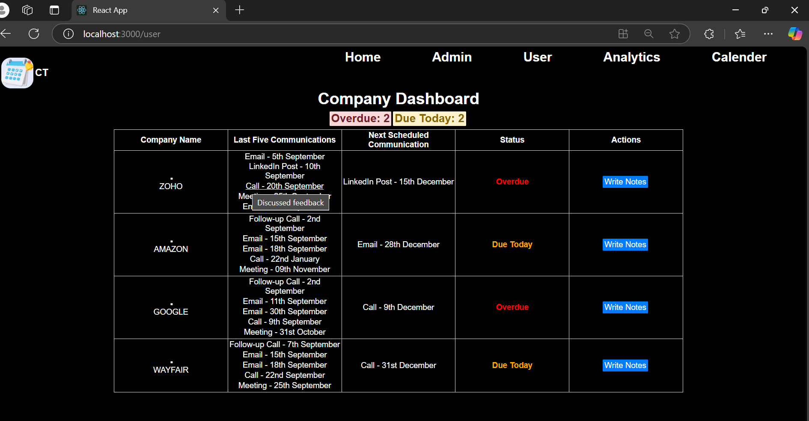

If we click on Write Notes.We will Write the notes.

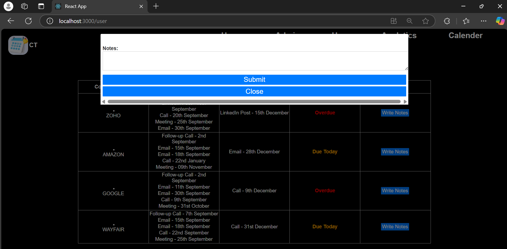

# Calender Page

In this Calender Page  we will see all the  Overdue Communications With Specified Date and Company_name And Upcoming Communications.
And it will show the color too in which Overdue indicated in red Color and Due Today will Be Indicated in Yellow Color.

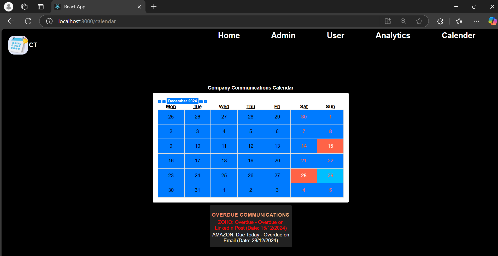

# Analytics Page
# Communication Frequesncy Report:

1.A visual representation (e.g., bar chart or pie chart) showing the frequency of each communication method (e.g., LinkedIn Post, Email) used over a selected time frame.
2.Users can filter by company, date range, or communication method.

# Engagement Effectiveness Dashboard:

1.Track and display which communication methods are most effective in terms of response or follow-up actions.
2.Include metrics like the percentage of successful responses to emails, phone calls, or LinkedIn messages.
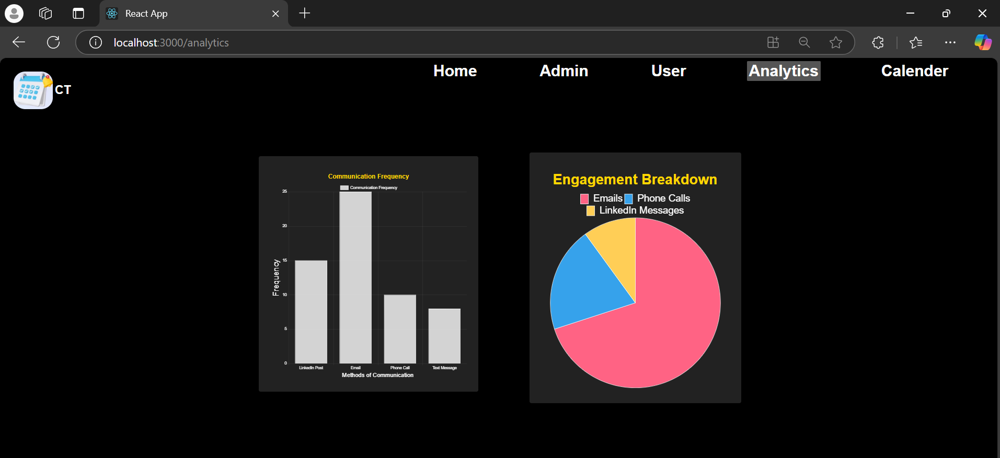

# Back-End(Server):

We need to connect to the Database using MongoDB
Install The dependencies
install the mongodb on your Server
npm install mongoose
We need to connect to the mongodb server using mongoose.connect()
# Set up the Server
Add the Environment Variables using .env file

MONGO_URI=mongodb://localhost:27017/yourDatabaseName

Now Add the Routes:
To handle The CRUD operations for MONGODB,create routes
Add Schema for each and every Collection Name

# To Start the Server(Test the server)
node server.js
This is the database in which we store all the companies information and We can Perform the CRUD operations

